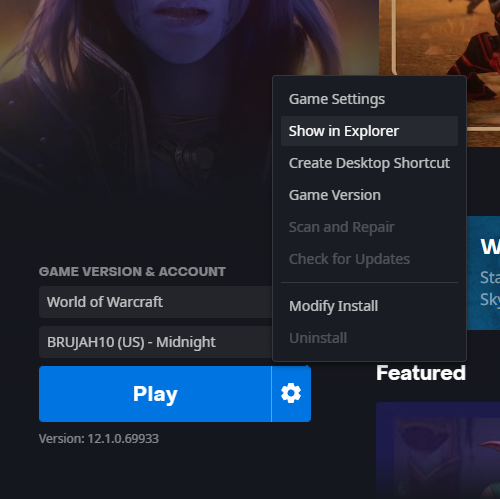
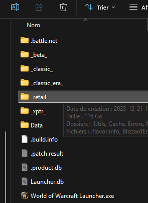
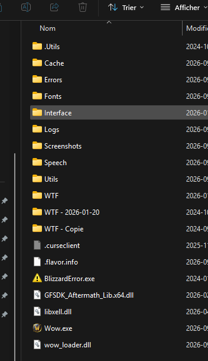
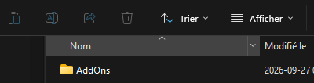
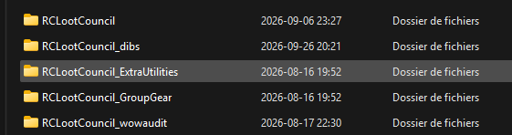

# RCLootCouncil_dibs v0.8.0 — Manual Installation Guide

Install the same compatible version as the rest of your guild so Dibs features work consistently. Installation is currently manual. This guide is for World of Warcraft Retail. RCLootCouncil_dibs is a separate addon from RCLootCouncil; the latter is optional and is only needed for the integrated loot workflow.

## Download

[Download RCLootCouncil_dibs v0.8.0](https://github.com/TrueBrujah/RCLootCouncil_dibs/releases/download/v0.8.0/RCLootCouncil_dibs-v0.8.0.zip)

**Version:** 0.8.0

Download the stable release ZIP above, not a development build.

## Quick Install

1. Download the v0.8.0 ZIP.
2. In Battle.net, select **World of Warcraft**, click the gear icon beside
	**Play**, and choose **Show in Explorer**.
3. Open `_retail_` > `Interface` > `AddOns`.
4. Extract or replace the `RCLootCouncil_dibs` folder directly inside `AddOns`.
5. Confirm `AddOns\RCLootCouncil_dibs\RCLootCouncil_dibs.toc` is directly
	inside the addon folder; avoid an extra nested `RCLootCouncil_dibs` folder.
6. Return to World of Warcraft. If it is already running, run `/reload`.
7. After the UI reload completes, run `/dibs status` and confirm version `0.8.0`.

> You do **not** need to completely exit World of Warcraft to install or update
> RCLootCouncil_dibs. A UI reload is normally sufficient.

## Step 1 — Download the release

Download the stable v0.8.0 ZIP from the link above.

## Step 2 — Open the WoW installation directory

1. Open Battle.net.
2. Select **World of Warcraft**.
3. Click the gear icon beside **Play**.
4. Click **Show in Explorer**.



Your installation drive and folder path may differ from the example paths in this guide.

## Step 3 — Open `_retail_`

World of Warcraft can contain several game folders. For the Retail client, open `_retail_`, not `_classic_`, `_classic_era_`, or `_beta_`.



Path: `World of Warcraft\_retail_`

## Step 4 — Open `Interface`

Inside `_retail_`, open the `Interface` folder.



Path: `World of Warcraft\_retail_\Interface`

## Step 5 — Open `AddOns`

Inside `Interface`, open `AddOns`.



Path: `World of Warcraft\_retail_\Interface\AddOns`

## Step 6 — Extract the addon

1. Open the downloaded v0.8.0 ZIP.
2. Extract the folder named `RCLootCouncil_dibs`.
3. Copy that folder into `World of Warcraft\_retail_\Interface\AddOns\`.
4. When updating, replace the existing `RCLootCouncil_dibs` folder with this
	version.

The final folder layout should look similar to this:

```text
AddOns
├── RCLootCouncil
├── RCLootCouncil_dibs
│   └── RCLootCouncil_dibs.toc
├── RCLootCouncil_ExtraUtilities
└── ...
```



### Important: Avoid the double-folder problem

> **Correct:** `...\AddOns\RCLootCouncil_dibs\RCLootCouncil_dibs.toc`
>
> **Wrong:** `...\AddOns\RCLootCouncil_dibs\RCLootCouncil_dibs\RCLootCouncil_dibs.toc`

If the ZIP creates an extra folder level, open the outer folder and move the inner `RCLootCouncil_dibs` folder directly into `AddOns`.

## Updating from an older version

1. Download the v0.8.0 ZIP.
2. Replace the existing `Interface\AddOns\RCLootCouncil_dibs` folder with the
	new version.
3. Do **not** delete the `WTF` folder or SavedVariables.
4. If World of Warcraft is already running, return to the game and run
	`/reload`.
5. Run `/dibs status` and confirm the loaded version is `0.8.0`.

Replacing the addon folder does not normally delete Dibs SavedVariables. WoW stores them under `WTF`, not inside `Interface\AddOns`.

## Step 7 — Enable the addon

If you are at the character-selection screen, open **AddOns** if needed and
confirm **RCLootCouncil_dibs** is enabled, then log into your guild character.
If you are already logged in, return to the game and run `/reload` after
installing or updating the files.

RCLootCouncil may also be installed separately if your guild uses the integrated loot workflow. It is not bundled inside RCLootCouncil_dibs.

## Step 8 — Verify the installation

After logging in, run either command:

```text
/dibs status
/dibs
```

The status should report version 0.8.0 as loaded. A normal player not having Officer access is expected; players do not need Officer or GM permissions to install or use their player features.

### After installing or updating

If WoW is already running, a full game restart is normally not required. Run
`/reload` to load the updated addon files. If the addon still does not appear,
return to the character-selection screen, confirm **RCLootCouncil_dibs** is
enabled in the **AddOns** list, and log back in.

## Troubleshooting

### Addon does not appear

- Confirm it is installed under `_retail_`.
- Confirm the folder is named exactly `RCLootCouncil_dibs`.
- Confirm `RCLootCouncil_dibs.toc` is directly inside that folder.
- If WoW is running, run `/reload`.
- If it still does not appear, return to the character-selection screen,
  confirm the addon is enabled, and log back into your guild character.
- Run `/dibs status` to check whether the addon loaded.

### “Out of date” or wrong version

- Remove the old addon program files and reinstall the v0.8.0 folder.
- Do not delete `WTF` or SavedVariables.
- If WoW is running, run `/reload`, then check `/dibs status` for version
	`0.8.0`.

### I installed it under `_classic_`

Install it under `World of Warcraft\_retail_\Interface\AddOns` instead.

### I have a double `RCLootCouncil_dibs` folder

Correct: `...\AddOns\RCLootCouncil_dibs\RCLootCouncil_dibs.toc`

Incorrect: `...\AddOns\RCLootCouncil_dibs\RCLootCouncil_dibs\RCLootCouncil_dibs.toc`

Move the inner folder directly into `AddOns`.

### Still having problems

Post in the guild Discord:

- A screenshot of `AddOns\RCLootCouncil_dibs`.
- A screenshot of the WoW AddOns list.
- The result of `/dibs status`.

Do not post SavedVariables publicly.

## Security and privacy

Do not upload or publicly share your `WTF` or SavedVariables files unless an Officer or developer specifically requests diagnostic data through a private channel. These files may contain guild and player history.
