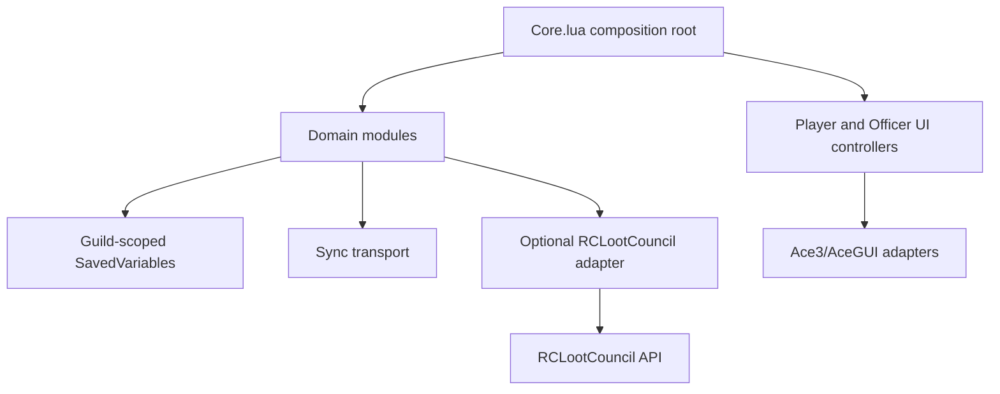

# Dibs addon architecture

This document describes the implementation loaded by `src/RCLootCouncil_dibs.toc`. The source and tests are authoritative; the documentation does not promise behavior that is absent from those files.

## Runtime shape

The addon uses one global namespace, `Dibs`. `Core.lua` creates the namespace, migrates `RCLootCouncil_dibsDB`, exposes `Dibs.CoreAPI`, installs slash commands, and routes runtime events. Modules are loaded in TOC order and attach their public functions to a namespace table. UI files are controllers and projections; domain modules remain the source of truth.

## Layers

- **Composition/runtime:** `Core.lua` and `integrations/Ace3.lua` initialize dependencies and route events.
- **Domain policy:** Seasons, RankRules, Permissions, CharacterEligibility, and PreDibs define policy and lifecycle validation.
- **Accounting/persistence:** Ledger, Backup, ImportExport, Profiles, and Disputes operate on the guild database.
- **Application adapters:** LootPipeline, RaidRelay, RaidPrompts, Readiness, DryRun, and Sync coordinate workflows.
- **External integrations:** RCLootCouncil, RCLootCouncilOptions, and EncounterJournal probe optional or Blizzard APIs.
- **UI:** AceGUI, PlayerUI, OfficerUI, DataUI, LogsUI, and DebugLogsUI build views and delegate actions.
- **Embedded/vendor libraries:** `src/libs/**` and `src/embeds.xml` provide Ace3, ScrollingTable, and serializer dependencies. They are not Dibs business modules.

## Authority boundaries

Guild GM/officer permission is the authority for Dibs administration. RCLootCouncil Master Looter authority is a separate capability used only for a verified live award callback. The adapter may be absent or degraded without disabling the local ledger and administrative views. `ProtectedActions.Execute` is the mutation boundary; `Readiness` and combat checks guard live operations.

## Data flow

Players create or confirm Pre-Dibs requests. Encounter context and RCLootCouncil responses can validate eligibility. A finalized qualifying award or an explicitly confirmed historical reconciliation creates an audited ledger use. Queries derive balances and history from append-only transactions. Sync exchanges bounded guild metadata and request revisions; live candidates, votes, and loot are deliberately excluded.

## Stores, controllers, and stateful components

`Dibs.Ledger`, `Dibs.PreDibs`, `Dibs.Seasons`, `Dibs.RankRules`, and the
versioned stores under `Dibs.GetDB()` are repositories/stores. `Dibs.Backup`,
`Dibs.ImportExport`, `Dibs.Profiles`, and `Dibs.Disputes` are persistence/audit
services around those stores. `Dibs.PlayerUI`, `Dibs.OfficerUI`, `Dibs.DataUI`,
and `Dibs.LogsUI` are controllers/projections; `Dibs.AceGUI` is their shared UI
component adapter. `Dibs.Ace3` is the framework adapter, not a business service.

The main state machines are the Pre-Dib request lifecycle, dispute review
lifecycle, reconciliation candidate decision lifecycle, season active/archived
state, readiness states, and bounded sync transfer state. Public APIs are the
namespace functions indexed in [api-reference.md](api-reference.md); private
helpers are local functions and are not compatibility surfaces. DeveloperMode,
DryRun, DebugLogs, and test doubles under `tests/` are test/dev-only components.

## Stable business rules

- **DIBS-RULE-001:** Dibs are seasonal accounting units, not DKP.
- **DIBS-RULE-002:** A boss kill does not create a Dib or request automatically.
- **DIBS-RULE-003:** Receiving loot does not consume a Dib unless a qualifying award is finalized or a historical award is explicitly confirmed.
- **DIBS-RULE-004:** A higher balance does not automatically win an item; RCLootCouncil voting/award identity remains external.
- **DIBS-RULE-005:** Allocation and balances are scoped to a season.
- **DIBS-RULE-006:** Rank rules determine grants for the configured season; they do not rewrite prior seasons.
- **DIBS-RULE-007:** Rank and audit evidence captured at transaction time remain part of history; rank changes do not rewrite history.
- **DIBS-RULE-008:** Corrections, imports, restores, and historical decisions are explicit, permission-checked, and auditable.
- **DIBS-RULE-009:** Protected UI and authoritative live actions respect combat lockdown and readiness.
- **DIBS-RULE-010:** Character eligibility requires approved relationships, policy evaluation, and bounded exceptions; similarity alone is not a link.
- **DIBS-RULE-011:** Vault acquisitions are display-only and never create ledger consumption.
- **DIBS-RULE-012:** Multiple raids may operate concurrently; accounting metadata may synchronize, but loot itself never transfers between raids.

See [modules](modules.md), [data model](data-model.md), [events](events.md), and [RCLootCouncil integration](rclc-integration.md).
